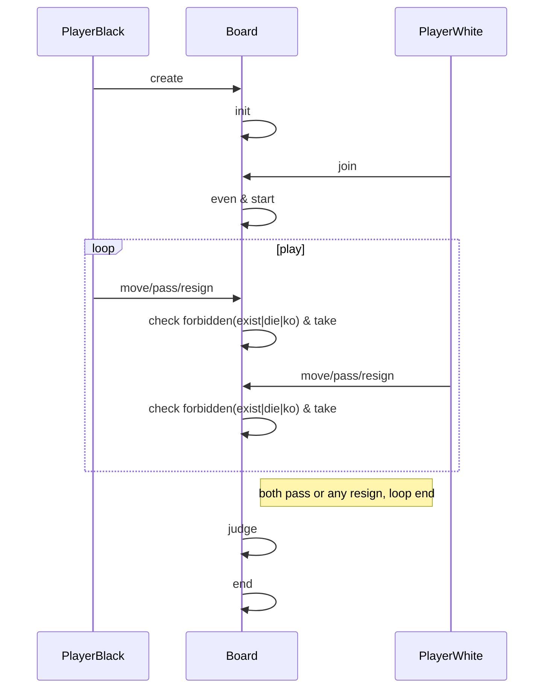

# jjyygo
Go engin impl with different languages.

## flow chart

```mermaid
sequenceDiagram
PlayerBlack->>Board: create
Board->>Board: init
PlayerWhite->>Board: join
Board->>Board: even & start
loop play
  PlayerBlack->>Board: move/pass/resign
  Board->>Board: check forbidden(exist|die|ko) & take
  PlayerWhite->>Board: move/pass/resign
  Board->>Board: check forbidden(exist|die|ko) & take
end
Note right of Board: both pass or any resign, loop end
Board->>Board: judge
Board->>Board: end
```
