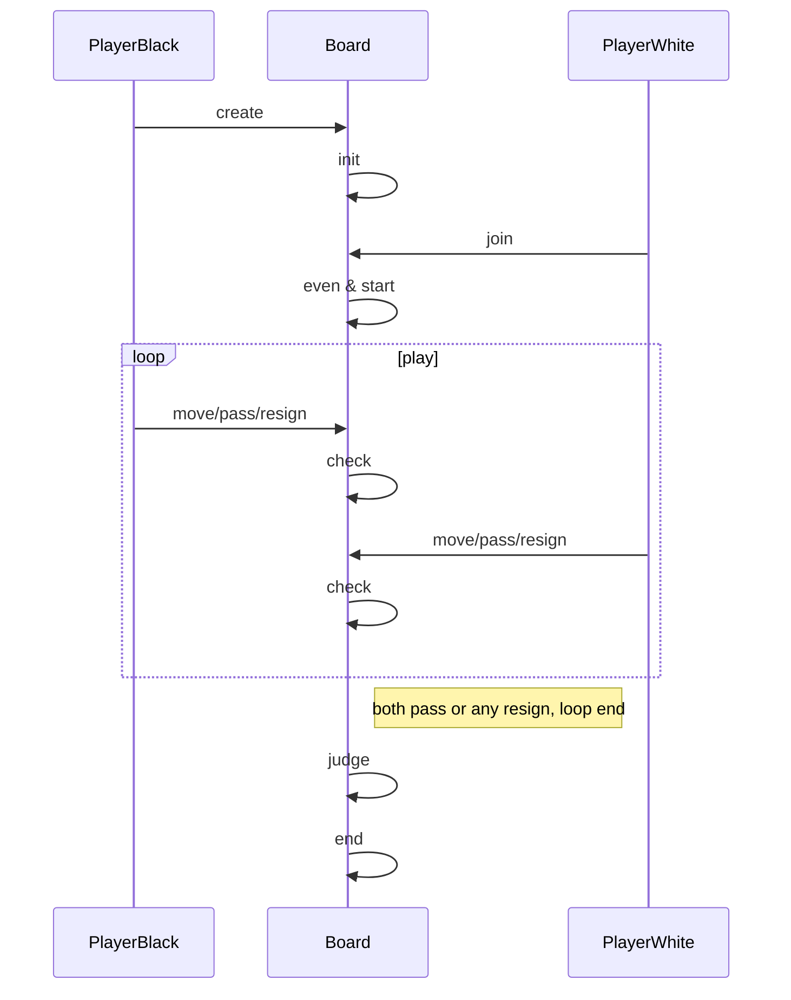
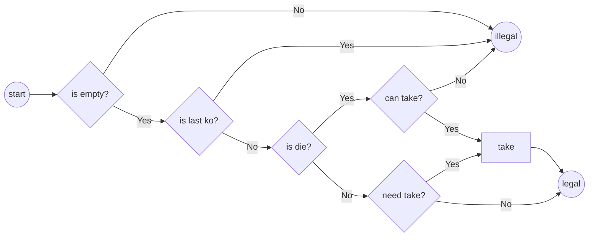
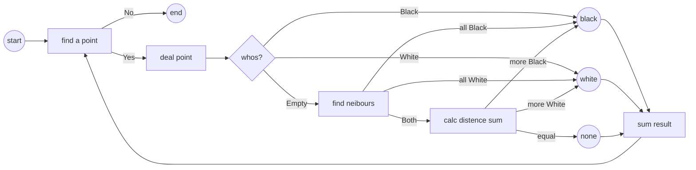

# jjyygo
Go engin impl with different languages.

## play sequence

```mermaid
sequenceDiagram
PlayerBlack->>Board: create
Board->>Board: init
PlayerWhite->>Board: join
Board->>Board: even & start
loop play
  PlayerBlack->>Board: move/pass/resign
  Board->>Board: check
  PlayerWhite->>Board: move/pass/resign
  Board->>Board: check
end
Note right of Board: both pass or any resign, loop end
Board->>Board: judge
Board->>Board: end
```

## check flow

```mermaid
flowchart LR
S((start))--> isEmpty{is empty?}
isEmpty --> |No| Illegal((illegal))
isEmpty --> |Yes| isLastKo{is last ko?}
isLastKo --> |Yes| Illegal
isLastKo --> |No| isDie{is die?}
isDie --> |Yes| canTake{can take?}
canTake --> |No| Illegal
canTake --> |Yes| take[take]
take --> legal((legal))
isDie --> |No| needTake{need take?}
needTake --> |Yes| take
needTake --> |No| legal
```

## judge flow

```mermaid
flowchart LR
S((start))-->findPoint[find a point]
findPoint-->|No|E((end))
findPoint-->|Yes|dealPoint[deal point]
sumResult-->findPoint

dealPoint-->whos{whos?}
whos-->|Black|B((black))
whos-->|White|W((white))
whos-->|Empty|findNeibours[find neibours]
findNeibours-->|all Black|B
findNeibours-->|all White|W
findNeibours-->|Both|calcDis[calc distence sum]
calcDis-->|more Black|B
calcDis-->|more White|W
calcDis-->|equal|None((none))
B-->sumResult[sum result]
W-->sumResult
None-->sumResult
```
